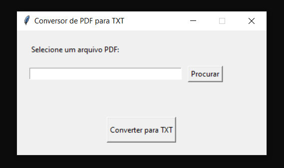

#  Conversor de PDF para TXT (com Interface)

Uma aplicação simples em Python que permite selecionar um arquivo PDF, extrair todo o texto e salvar em um arquivo `.txt`. Desenvolvido com `tkinter` para a interface gráfica e `pdfplumber` para a extração do conteúdo.

##  Tecnologias Utilizadas

- Python 3.x
- [pdfplumber](https://github.com/jsvine/pdfplumber)
- tkinter 
